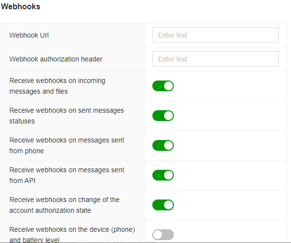

# Получение уведомлений через HTTP API

Получать входящие уведомления (сообщения, статусы) можно через HTTP API запросы по аналогии, как реализованы остальные методы Green API. При этом гарантируется хронологический порядок следования уведомлений в той последовательности, в которой они были получены [FIFO](https://ru.wikipedia.org/wiki/FIFO). Все входящие уведомления сохраняются в очереди и ожидают своего получения в течение 24 часов.

Для получения входящих уведомлений требуется выполнить последовательно вызов двух методов [ReceiveNotification](technology-http-api/ReceiveNotification.md) и [DeleteNotification](technology-http-api/DeleteNotification.md). Метод [ReceiveNotification](technology-http-api/ReceiveNotification.md) выполняет получение входящего уведомления. Метод [DeleteNotification](technology-http-api/DeleteNotification.md) подтверждает успешное получение и обработку уведомления. Подробнее о методах смотрите в соответствующих разделах [ReceiveNotification](technology-http-api/ReceiveNotification.md) и [DeleteNotification](technology-http-api/DeleteNotification.md).

> Срок хранения входящих уведомлений составляет 24 часа.

## Настройка аккаунта

Перед получением входящих уведомлений требуется выполнить настройку аккаунта. Настройка аккаунта может быть выполнена [программно](#SetSettings) с использованием метода [SetSettings](../account/SetSettings.md), либо [интерактивно](#cabinet) в интерфейсе личного кабинета.

### Настройка методом [SetSettings](../account/SetSettings.md) {#SetSettings}

Для настройки получения входящих уведомлений по технологии HTTP API требуется указать в качестве параметра `webhookUrl` значение:

```
https://webhook.green-api.com
```

Также требуется указать какие виды уведомлений необходимо получать. Для включения входящих уведомлений по видам, а также для указания параметра `webhookUrl` воспользуйтесь методом [SetSettings](../account/SetSettings.md).

#### Пример тела запроса метода [SetSettings](../account/SetSettings.md)

```json
{
    "webhookUrl": "https://webhook.green-api.com",
    "outgoingWebhook": "yes",
    "stateWebhook": "yes",
    "incomingWebhook": "yes",
    "deviceWebhook": "no"
}
```

### Настройка в личном кабинете {#cabinet}

Настройку получения входящих уведомлений можно также выполнить интерактивно. Для этого перейдите в [Личный кабинет](https://cabinet.green-api.com) и выберите требуемый аккаунт. Если аккаунт авторизован, то будут отображены настройки для получения входящих уведомлений см. рис. Укажите значение параметра `webhookUrl`, а также переключатели по видам уведомлений. Если аккаунт не авторизован и настройки уведомлений не отображаются, обратитесь к разделу [Перед началом работы](../../before-start.md#qr).



## Получение входящих уведомлений

После выполнения настройки аккаунта можно приступать к получению уведомлений методами [ReceiveNotification](technology-http-api/ReceiveNotification.md) и [DeleteNotification](technology-http-api/DeleteNotification.md). Пример кода получения уведомлений на [NodeJS](https://nodejs.org) можно посмотреть в файле [ReceiveNotifications](https://github.com/green-api/whatsapp-api-client/blob/master/examples/ReceiveNotifications.js).

Подробное описание формата входящих уведомлений представлено в разделе [Формат входящих уведомлений](notifications-format/index.md).