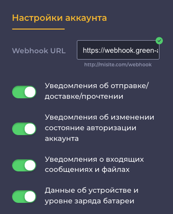

# Webhook HTTP API

Технология Webhook HTTP API позволяет выполнять получение входящих webhook уведомлений через обычные HTTP API запросы по аналогии, как реализованы остальные методы Green API. При этом гарантируется хронологический порядок следования уведомлений в той последовательности, в которой они были получены (FIFO). Технология Webhook HTTP API является рекомендуемым способом получения входящих данных. Реализовать получение данных по этой технологии проще по сравнению с технологией [Webhook Endpoint](webhook-endpoint.md). Дополнительным преимуществом является гарантированная доставка входящих данных. Все входящие данные сохраняются в очереди и ожидают своего получения в течение 24 часов.
Для получения входящих данных требуется выполнить последовательно вызов двух методов [ReceiveWebhook](webhook-http-api/ReceiveWebhook.md) и [DeleteWebhook](webhook-http-api/DeleteWebhook.md). Метод [ReceiveWebhook](webhook-http-api/ReceiveWebhook.md) выполняет получение входящего уведомления. Метод [DeleteWebhook](webhook-http-api/DeleteWebhook.md) подтверждает успешное получение и обработку уведомления. Подробнее о методах смотрите в соответствующих разделах [ReceiveWebhook](webhook-http-api/ReceiveWebhook.md) и [DeleteWebhook](webhook-http-api/DeleteWebhook.md).

> Срок хранения входящих webhook уведомлений составляет 24 часа.

## Настройка методом [SetSettings](../account/SetSettings.md)

Для настройки получения webhook уведомлений по технологии Webhook HTTP API требуется указать в качестве параметра `webhookUrl` значение:

```
https://webhook.green-api.com/v1/
```

Также требуется указать какие виды webhook уведомлений требуется получать. Для включения webhook уведомлений по видам, а также для указания параметра `webhookUrl` воспользуйтесь методом [SetSettings](../account/SetSettings.md).

### Пример тела запроса метода [SetSettings](../account/SetSettings.md)

```json
{
    "webhookUrl": "https://webhook.green-api.com/v1/",
    "outgoingWebhook": "yes",
    "stateWebhook": "yes",
    "incomingWebhook": "yes",
    "deviceWebhook": "no"
}
```

## Настройка в личном кабинете

Настройку получения webhook уведомлений можно также выполнить интерактивно. Для этого перейдите в [Личный кабинет](https://cabinet.green-api.com) и выберите требуемый аккаунт. Если аккаунт авторизован, то будут отображены настройки для получения webhook уведомлений см. рис. Укажите значение параметра `webhookUrl`, а также переключатели по видам webhook уведомлений. Если аккаунт не авторизован и настройки webhook уведомлений не отображаются, обратитесь к разделу [Перед началом работы](../../before-start.md#qr).



## Получение webhook уведомлений

После выполнения настройки аккаунта можно приступать к получению webhook уведомлений методами [ReceiveWebhook](webhook-http-api/ReceiveWebhook.md) и [DeleteWebhook](webhook-http-api/DeleteWebhook.md). Пример кода получения webhook уведомлений на [NodeJS](https://nodejs.org) можно посмотреть в [файле](https://github.com/green-api/whatsapp-api-client/blob/master/examples/SendReceiveMessageUsingWebhookService.js).

Подробное описание структуры webhook уведомлений представлено в разделе [Webhook уведомления](webhook/index.md).